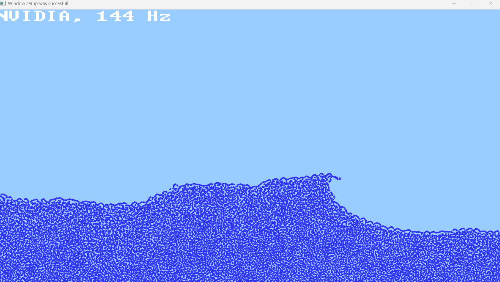

# About

This project is about building a simple Windows only SPH fluid simulator using a ghost particle boundary approach (at the moment only a 2D SPH fluid simulator). The code uses no external libraries since I made a simple graphics library myself that uses only the win32 and DirectX11 APIs. The only tools used are [make for windows](https://gnuwin32.sourceforge.net/packages/make.htm) (every program here has a Makefile) and [the cl.exe tool](https://learn.microsoft.com/en-us/cpp/build/reference/compiler-options?view=msvc-170) from Visual Studio 2019 (used for compilation of the programs and the library). I also use the GPU to accelerate the SPH fluid simulator and for this I use the [NVCC CUDA compiler](https://developer.nvidia.com/cuda-downloads) from the CUDA toolkit which thus only works for NVIDIA GPUs (but there is also code for a non-GPU accelerated SPH simulator, so this is not strictly necessary).

Also: apparently the file reading methods used in the code here might give issues if there are spaces somewhere in the full path to get to where this folder is stored.

# Index
## [lib](./lib/)

Folder that contains code for the graphics library. Also, lib/binaries is usually where all the executables get dumped after running the Makefiles.

## [lib_usage_example](./lib_usage_example/)

Folder that contains some examples on how to use the graphics library.

## [simulation_layout](./simulation_layout/)

Folder that can be used to dump simulation text files made by the 2D_simulation_maker program or from the example_simulations folder. The simulation file should be called "2D_simulation.txt".

## [example_simulations](./example_simulations/)

Folder that contains some example simulations (text files).

## [2D_simulation_maker](./2D_simulation_maker/)

Folder that contains a program that can be used to create a custom 2D simulation setup.

## [2D_no_CUDA](./2D_no_CUDA/)

Folder that contains code for a non-GPU accelerated 2D SPH simulator.

## [2D_with_CUDA](./2D_with_CUDA/)

Folder that contains code for a CUDA accelerated 2D SPH simulator.

# How to use

First compile the library in the [lib](./lib) folder.

```
DirectX11_CUDA_SPH_fluid_simulator\lib> make
...
Library build successfully
```

During compilation, there will be a search first for the `nvcc` compiler. If `nvcc` compiler is not found, there will be warning and it will try compiling using the Visual Studio `cl.exe` tool:

```
Warning: the graphics library is being compiled without CUDA support because the NVCC compiler could not be found
```

Then to build the 2D simulator without GPU support, go to the [2D_no_CUDA](./2D_no_CUDA/) folder and:

```
DirectX11_CUDA_SPH_fluid_simulator\2D_no_CUDA> make
...
Executable build successfully, the executable can be found in the binaries folder in the lib directory
```

This will produce an executable in [lib\binaries](lib/binaries) called `2D_no_CUDA_run.exe` which can be run to start the fluid simulation.

To build the 2D fluid simulator with GPU support, go to the [2D_with_CUDA](./2D_with_CUDA/) folder and:

```
DirectX11_CUDA_SPH_fluid_simulator\2D_with_CUDA> make
...
Executable build successfully, the executable can be found in the binaries folder in the lib directory
```

This will produce an executable in [lib\binaries](lib/binaries) called `2D_with_CUDA_run.exe`.

# Todo

- Allowing custom window sizes in the graphics library
- Adding surface forces to the SPH fluid simulator
- Making a GPU and non-GPU accelerated 3D SPH simulator

